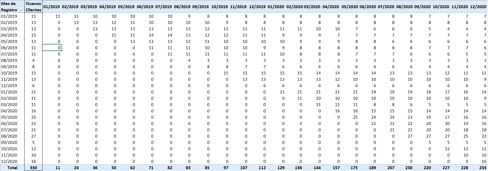
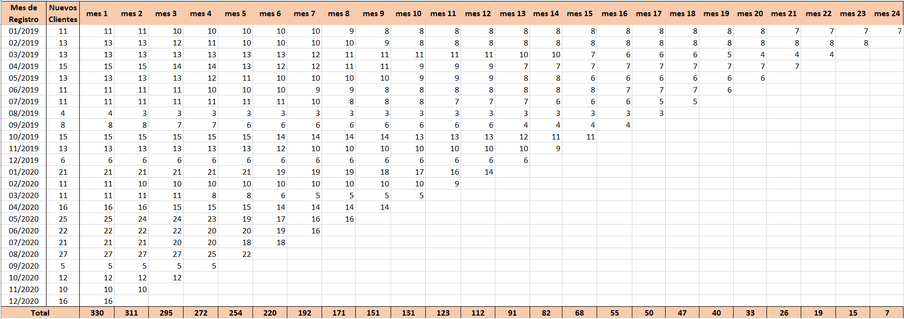
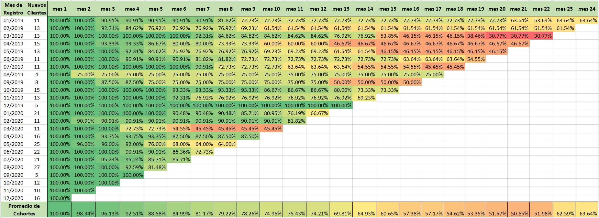
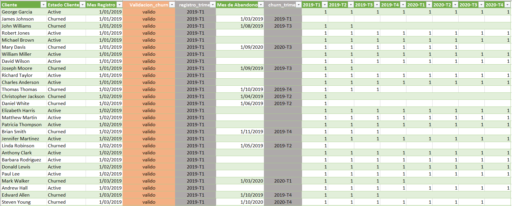
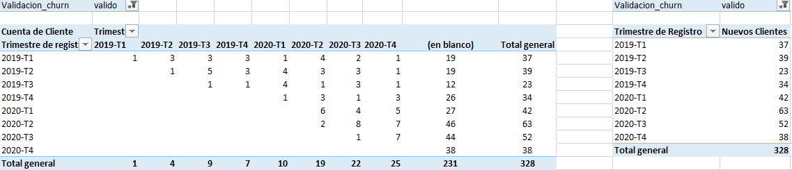
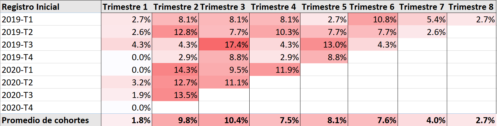

# Proceso de transformación y análisis 
Informe: [Análisis de Cohortes y Retención de clientes en una Startup Tecnológica](https://github.com/gabcadi30/analisis-cohortes-retencion-clientes-excel)
___

## 1. Importación de los datos

Se importaron los dos archivos CSV en Excel mediante Power Query:

* El primer archivo contiene el historial mensual de actividad de los clientes. Con columnas como: cliente, estado de cliente, mes registro, mes abandono,01/2019, 02/2019,etc (331 filas, 28 columnas).
* El segundo archivo contiene la misma base de datos pero agrupado trimestralmente. Con columnas como: cliente, estado cliente, mes registro, mes abandono,2019-T1,2019-T2, etc (331 filas, 12 columnas).

## 2. Construcción de la tabla dinámica de actividad mensual

A partir de la tabla retencion_por_mes se creó una tabla dinámica para agrupar a los clientes según su mes de registro.




La columna de "Nuevos Clientes" representa el tamaño inicial de cada cohorte. Por su parte, la suma de los indicadores (valores de '1' y '0') mensuales permite conocer cuántos clientes de esa cohorte permanecían activos en cada mes calendario durante los 24 meses desde 01/2019 al 12/2020. 

## 3. Creación de una tabla auxiliar

La tabla dinámica muestra la actividad según meses calendario, sin embargo, las cohortes comienzan en meses diferentes, por lo que sus resultados no pueden compararse directamente.

Por ejemplo, para la cohorte de enero de 2019, enero representa su primer mes; para la cohorte de febrero de 2019, su primer mes es febrero.

Para resolverlo se creó una tabla auxiliar en la hoja `referencia` que será utilizada para reorganizar las cohortes según el tiempo transcurrido desde su registro.

## 4. Alineación de las cohortes mensuales
Creamos una tercera tabla donde referenciamos los valores de la hoja de 'referencia' y usaremos una combinación de las funciones: `INDICE`, `COINCIDIR` y `COLUMNAS` para localizar el mes de registro de cada cohorte y desplazar los valores hacia la izquierda.

```excel
=SI.ERROR(INDICE(referencia!$C2:$Z2;1;COINCIDIR(referencia!$A2;referencia!$C$1:$Z$1;0)+COLUMNAS(referencia!$C:C)-1);" ")
```

La fórmula cumple las siguientes funciones:

* `COINCIDIR` identifica la posición del mes en el que comenzó la cohorte.
* `COLUMNAS` aumenta progresivamente la posición al copiar la fórmula hacia la derecha.
* `INDICE` devuelve la cantidad de clientes activos correspondiente.
* `SI.ERROR` deja vacíos los periodos que todavía no han sido alcanzados por las cohortes más recientes y evita el #REF!

Después de copiar la fórmula hacia la derecha y hacia abajo, todas las cohortes comenzaron en el **mes 1**, correspondiente a su mes de registro, independientemente del mes calendario en el que se incorporaron.




## 5. Cálculo de la tasa de retención

Creamos una cuarta y última tabla que será nuestra matriz de retención. Cada cohorte se dividió la cantidad de clientes activos de cada mes entre el número inicial de clientes de esa cohorte:

```text
Tasa de retención =
Clientes activos en el mes / Clientes iniciales de la cohorte
```

- El primer mes de cada cohorte presenta una retención del 100 %, ya que los clientes se encontraban activos en el momento de su registro.

- Los espacios vacíos NO representan una retención de 0 %. Indican que la cohorte todavía no había alcanzado esa antigüedad cuando finalizó el periodo disponible en el dataset.

## 6. Visualización de la retención

Se aplicó formato condicional con escala de colores a la matriz porcentual. Esto permite identificar visualmente los meses donde la pérdida de clientes es mayor y la tasa de retención aumenta o disminuye.



También se incorporó una fila de **"Promedio de cohortes"**, calculada con las cohortes que cuentan con información en cada mes.Este promedio debe interpretarse con cautela porque la cantidad de cohortes disponibles disminuye en los meses más avanzados. Por ejemplo, el mes 23 contiene solamente dos cohortes y el mes 24 corresponde a una sola.

## 7. Preparación de la matriz de abandono trimestral

Para construir la matriz de abandono se trabajó con la segunda tabla importada mediante Power Query.

Se crearon dos columnas personalizadas:

* `registro_trimes`, que identifica el año y trimestre de registro;
* `churn_trimes`, que identifica el año y trimestre de abandono.

Los campos fueron transformados a una etiqueta de texto con el formato:

```text
2019-T1
2019-T2
2019-T3
2019-T4
```
Estas etiquetas permitieron agrupar a los clientes y ordenar cronológicamente en trimestres para la creación de las tablas dinámicas.



## 8. Validación de la información de abandono

Durante la preparación del análisis trimestral se revisó la calidad de los datos y su congruencia.

Se encontraron dos registros clasificados como "activos" que también tenían registrada una fecha de abandono. Debido a esta contradicción, no era posible determinar con seguridad cuál de los dos valores era correcto.

Los registros no fueron eliminados ni corregidos arbitrariamente. Se creó la columna `Validacion_churn` para clasificarlos como:

* `valido`: no presenta contradicción;
* `invalido`: figura como activo, pero tiene fecha de abandono.

La tabla dinámica de abandono se filtró para trabajar únicamente con los 328 registros válidos. Los 330 registros originales se mantuvieron en el análisis mensual de actividad, porque sus indicadores mensuales sí permitían observar su permanencia.

## 9. Construcción de la tabla dinámica de abandono

Con los registros válidos se creó una tabla dinámica configurada de la siguiente forma:

* **Filas:** trimestre de registro.
* **Columnas:** trimestre de abandono.
* **Valores:** conteo de clientes.
* **Filtro:** `Validacion_churn = valido`.



Esta tabla muestra en qué trimestre calendario abandonaron los clientes pertenecientes a cada cohorte.

Los clientes sin fecha de abandono aparecen en la categoría `(en blanco)`. Esta categoría no se incluyó como abandono, porque representa clientes sin un churn registrado.

También se calculó por separado el número total de clientes registrados en cada trimestre. Este valor se utilizó posteriormente como denominador para calcular la tasa de abandono.

## 10. Alineación de los trimestres

Al igual que en el análisis mensual, la tabla dinámica trimestral mostraba periodos calendario que no podían compararse directamente.

Se utilizó nuevamente una combinación de `INDICE`, `COINCIDIR` y `COLUMNAS` para alinear los abandonos según el trimestre transcurrido desde el registro:

```excel
=SI.ERROR(INDICE($B5:$I5;1;COINCIDIR($A5;$B$4:$I$4;0)+COLUMNAS($B:B)-1);" ")
```
De esta manera:
* el trimestre de registro pasó a ser el trimestre 1;
* el siguiente periodo pasó a ser el trimestre 2;
* los demás abandonos se desplazaron según la antigüedad correspondiente.

## 11. Cálculo de la tasa de abandono

Finalmente, la cantidad de abandonos ocurridos en cada trimestre de antigüedad se dividió entre el número inicial de clientes de la cohorte:

```text
Tasa de abandono del trimestre =
Clientes que abandonaron en el trimestre / Clientes iniciales de la cohorte
```

Esta tasa representa el porcentaje de la cohorte que abandonó específicamente durante cada trimestre. No corresponde a una tasa acumulada.

Se aplicó formato condicional a la matriz para identificar los periodos del ciclo de vida en los que se concentra una mayor proporción de abandonos.



## 12. Resultados obtenidos

El proceso produjo dos visualizaciones principales:

* Una matriz mensual de retención que muestra la permanencia de los clientes según su antigüedad.
* Una matriz trimestral de abandono que muestra en qué etapa del ciclo de vida se concentran las cancelaciones.

Estas matrices se utilizaron para evaluar la evolución de las cohortes y sustentar la recomendación de inversión presentada en el README principal.


